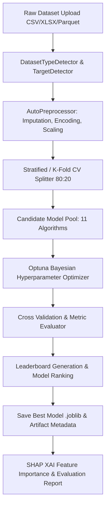

# Automated Machine Learning (AutoML) System Architecture Document
## AI Data Analysis Platform

**Versi Engine:** 1.0.0  
**Desain Sistem:** Zero-Code End-to-End AutoML Orchestrator  
**Jumlah Algoritma:** 11 Algoritma ML Supervised (Klasifikasi & Regresi)  

---

## 1. Alur Kerja & Komponen Utama Sistem AutoML (`app/automl_engine/`)

---

## 2. Penjelasan Detail Tahapan Sistem AutoML

### 2.1 Deteksi Tipe Dataset Otomatis (`DatasetTypeDetector`)
Sistem secara otomatis menganalisis tipe data dari berkas yang diunggah:
* **`TABULAR_CLASSIFICATION`**: Fitur berbentuk baris/kolom dengan variabel target berjenis kategorial atau numerik diskrit ($< 15$ nilai unik).
* **`TABULAR_REGRESSION`**: Fitur berbentuk baris/kolom dengan variabel target berjenis numerik kontinu ($> 15$ nilai unik).
* **`TIME_SERIES`**: Terdeteksi apabila memiliki kolom bertipe `datetime` atau kata kunci tanggal/waktu.
* **`TEXT`**: Terdeteksi jika mayoritas kolom berisi string teks panjang.

### 2.2 Penentuan Target Otomatis (`TargetDetector`)
Jika pengguna tidak menentukan kolom target secara manual:
1. **Pencarian Kata Kunci:** Menyeleksi nama kolom berlabel `target`, `label`, `class`, `y`, `output`, `price`, `status`, `survived`.
2. **Fallback:** Jika tidak ada kata kunci yang cocok, kolom terakhir dalam dataset secara konvensi ditetapkan sebagai target.

### 2.3 Preprocessing Otomatis (`AutoPreprocessor`)
* **Imputasi Missing Values:** Imputasi nilai kosong menggunakan median untuk variabel numerik dan modus (*most frequent*) untuk variabel kategorial.
* **Encoding Otomatis:** Mengubah variabel string kategorial menjadi bentuk numerik menggunakan `LabelEncoder`.
* **Scaling Otomatis:** Menormalisasi seluruh skala fitur numerik menggunakan `StandardScaler`.

### 2.4 Evaluasi Minimal 11 Algoritma Machine Learning (`ModelFactory`)
AutoML mencoba dan mengevaluasi 11 algoritma berkinerja tinggi:
1. **Random Forest Classifier / Regressor**
2. **Extra Trees Classifier / Regressor**
3. **Gradient Boosting Classifier / Regressor**
4. **AdaBoost Classifier / Regressor**
5. **Decision Tree Classifier / Regressor**
6. **Logistic Regression / Ridge Regressor**
7. **Support Vector Machine (SVC / SVR)**
8. **K-Nearest Neighbors (KNN)**
9. **XGBoost Classifier / Regressor**
10. **LightGBM Classifier / Regressor**
11. **CatBoost Classifier / Regressor**

### 2.5 Hyperparameter Tuning & Cross Validation (`OptunaHyperparameterTuner`)
* **Pencarian Parameter:** Menggunakan *Optuna Bayesian Optimization* (pencarian cerdas 5–20 trial per model).
* **Cross-Validation:** 5-Fold Stratified Cross Validation untuk Klasifikasi dan 5-Fold K-Fold Cross Validation untuk Regresi guna mencegah *overfitting*.

### 2.6 Pemilihan Model Terbaik & Penyimpanan (.joblib)
Model diperingkat dalam **Leaderboard** berdasarkan skor metrik utama ($F_1$-Score / Accuracy untuk Klasifikasi; $R^2$-Score untuk Regresi). Model dengan skor tertinggi dipilih otomatis dan disimpan dalam format biner `.joblib` di `models_registry/`.

### 2.7 Generasi Laporan Evaluasi Otomatis
Sistem menghasilkan ringkasan laporan berbasis JSON/PDF yang mencakup:
* Metrik performa per model (*Accuracy, Precision, Recall, F1, ROC-AUC, MSE, RMSE, R2*).
* Peringkat *Leaderboard* lengkap.
* SHAP Global Feature Importance.
* Metadata eksperimen dan lokasi penyimpanannya.
