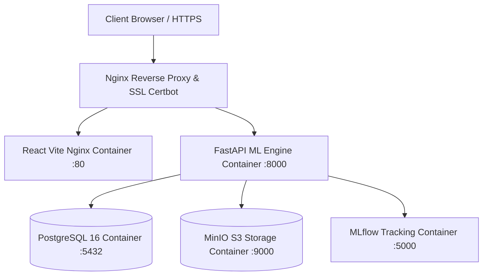

# Production DevOps & Multi-Cloud Deployment Document
## AI Data Analysis Platform

**Versi DevOps:** 1.0.0  
**Containerization:** Multi-Stage Docker & Docker Compose  
**Cloud Platforms:** Render, Railway, Ubuntu VPS  
**SSL & Reverse Proxy:** Nginx + Let's Encrypt Certbot  
**Automation:** GitHub Actions CI/CD Pipeline  

---

## 1. Topologi Containerization (`docker-compose.yml`)



---

## 2. Rincian Konfigurasi Deployment Proyek

### 2.1 Multi-Stage Dockerfile Backend (`backend/Dockerfile`)
* **Stage 1 (Builder):** Mengompilasi *wheel dependencies* C/C++ (seperti `libpq-dev`, `gcc`).
* **Stage 2 (Runner):** Gambar ramping `python:3.11-slim` dengan `HEALTHCHECK` otomatis via `curl`.

### 2.2 Multi-Stage Dockerfile Frontend (`frontend/Dockerfile`)
* **Stage 1 (Builder):** Mengompilasi aplikasi React menggunakan Node.js 20.
* **Stage 2 (Runner):** Server Nginx Alpine berkinerja tinggi menyajikan statis file bundel.

### 2.3 Nginx Reverse Proxy & SSL Let's Encrypt (`nginx/nginx.conf`)
* Mengarahkan seluruh lalu lintas HTTP (Port 80) ke HTTPS (Port 443).
* Mengonfigurasi `ssl_certificate` Let's Encrypt Certbot untuk keamanan TLS 1.3.

---

## 3. Opsi Deployment Multi-Cloud

### 3.1 Deploy ke Render (`render.yaml`)
1. Hubungkan repositori GitHub Anda ke dashboard Render.com.
2. Render akan secara otomatis mendeteksi `render.yaml` untuk menyiapkan PostgreSQL Database dan Web Service container.

### 3.2 Deploy ke Railway (`railway.json`)
1. Eksekusi `railway up` melalui Railway CLI atau hubungkan repositori via dashboard Railway.app.
2. Tambahkan layanan PostgreSQL dan setel *environment variables*.

### 3.3 Deploy ke Ubuntu VPS (Dokker Compose + Systemd)
1. **Langkah 1: Clone Repositori di VPS**
   ```bash
   git clone https://github.com/your-org/ai-data-analysis-platform.git /opt/ai-data-platform
   cd /opt/ai-data-platform
   ```
2. **Langkah 2: Setel Environment Variables**
   ```bash
   cp .env.production .env
   ```
3. **Langkah 3: Jalankan Container Service**
   ```bash
   docker compose up -d --build
   ```
4. **Langkah 4: Generate SSL Certbot**
   ```bash
   sudo apt-get install certbot python3-certbot-nginx
   sudo certbot --nginx -d aidataplatform.com -d www.aidataplatform.com
   ```
